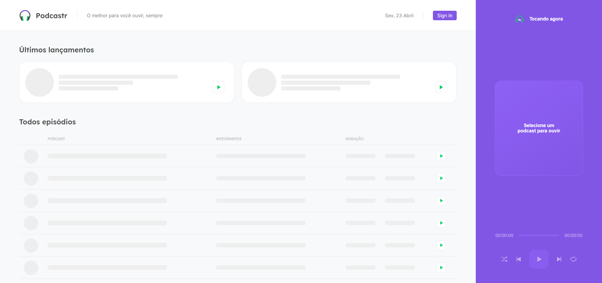
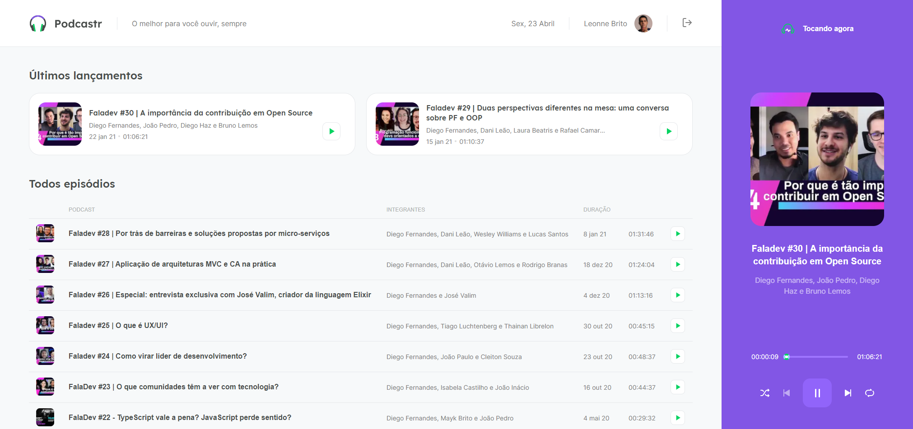

<p align="center">
   
</p>

<p align="center">	
   <a href="https://www.linkedin.com/in/leonne-sousa-brito/">
      
   </a>
  
  
  <a aria-label="Completed" href="https://nextlevelweek.com/episodios/react/1/edicao/5">
    </img>
  </a>
  
  
  <a href="mailto:contato@leonnebrito.com.br">
   
  </a>
</p>

<p align="center">
  🎧 The best for you to hear, always. Next Level Week #05 - <a href="https://github.com/Rocketseat">@Rocketseat</a>
</p>

<div align="center">
  <sub> Made with 💖 by
    <a href="https://github.com/LeonneBrito">Leonne Brito</a> and
    <a href="https://github.com/Rocketseat">
      Rocketseat for NLW #5.
    </a>
  </sub>
</div>

# 📌 Contents

* [Screenshots](#camera-screenshot) 
* [Technologies](#rocket-technologies) 
* [Features](#stars-features) 
* [How to Run](#computer-how-to-run)
* [Issues](#bug-issues)
* [Contributing](#sparkles-issues)
* [License](#page_facing_up-license)

# :camera: Screenshots
<div align="center">
   
   
   
</div>

# :rocket: Technologies
This project was made using the follow technologies:

* [Typescript](https://www.typescriptlang.org/)      
* [React](https://reactjs.org/)      
* [Next.js](https://nextjs.org/)  
* [RC-Slider](https://github.com/react-component/slider/)
* [JSON-Server](https://github.com/typicode/json-server)
* [SASS](https://sass-lang.com/)
* [Date-FNS](https://date-fns.org/)

# :computer: How to run

```bash
# Clone Repository
$ git clone https://github.com/LeonneBrito/podcastr.git
```

```bash
# Install Dependencies
$ yarn

#Run server
$ yarn server

# Run Aplication
$ yarn dev
```
Go to http://localhost:3000/ to see the result.

# :bug: Issues

Create a <a href="https://github.com/LeonneBrito/podcastr/issues">new issue report</a>, it will be an honor to be able to help you solve and further improve our application.

# :sparkles: Contributing

- Fork this repository;
- Create a branch with your feature: `git checkout -b my-feature`;
- Commit your changes: `git commit -m 'feat: My new feature'`;
- Push to your branch: `git push origin my-feature`.

# :page_facing_up: License

This project is under the [MIT license](./LICENSE).
Made with 💖 by [Leonne Brito](https://www.linkedin.com/in/leonne-sousa-brito/). 

Thank you! 🌠
